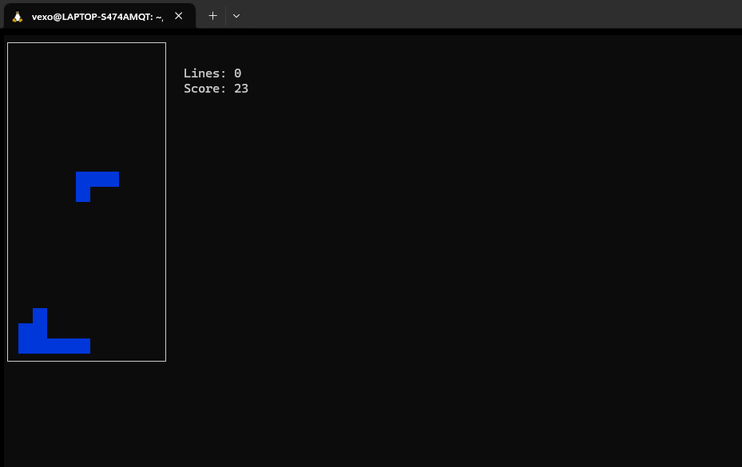

Here's an updated version of the `README.md` that places emphasis on the kernel-level security and anti-cheat features, breaking them down in the Table of Contents and providing detailed explanations for each component.

---

# Tetris Game with Kernel-Level Security and Anti-Cheat Measures

This project is a classic Tetris game enhanced with advanced security features like kernel-level memory protection and anti-cheat mechanisms. Designed to run on various platforms, this game aims to provide a tamper-resistant environment, preventing unauthorized modifications and ensuring fair play.

---

## Table of Contents
- [Introduction](#introduction)
- [Features](#features)
- [Gameplay](#gameplay)
- [Installation](#installation)
- [Running the Game](#running-the-game)
- [Kernel-Level Security & Anti-Cheat](#kernel-level-security--anti-cheat)
    - [Anti-Debug](#anti-debug)
    - [Integrity Checks](#integrity-checks)
    - [Input Validator](#input-validator)
    - [Process Protection](#process-protection)
- [Testing](#testing)
- [Future Enhancements](#future-enhancements)
- [Screenshots](#screenshots)


---

## Introduction
This Tetris game includes unique security features that make it resistant to common memory-based cheats or hacks. Using kernel-level protection, the game monitors its memory integrity and actively protects sensitive data from tampering. It also utilizes hash-based integrity checks to detect unauthorized modifications.

---

## Features

- **Classic Tetris Gameplay:** Enjoy the familiar mechanics of Tetris, complete with block rotation, scoring, and increasing difficulty levels.
- **Kernel-Level Security:** Integrated memory monitoring and protection that enforces security at the kernel level, helping prevent cheats that attempt to read or alter in-memory data.
- **Anti-Cheat Mechanisms:** Anti-cheat algorithms designed to detect memory modifications and trigger defensive actions.
- **Platform-Specific Security Configurations:** Compatible with various OS environments, particularly Linux and Windows, with adaptable security configurations.

---

## Gameplay
- Use the arrow keys to control blocks.
- Complete rows to score points, with the game ending if blocks stack up to the top of the screen.
  
---

## Installation

1. **Clone the Repository:**
   ```bash
   git clone https://github.com/lvexol/tetris-terminal.git
   cd tetris-game-with-security
   ```

2. **Install Dependencies:**
   ```bash
   pip install windows-curses  # Only needed for Windows
   ```

3. **Compile Security Modules** (if applicable):
   Kernel-level or low-level modules may need platform-specific compilation. (mostly not needed)

---

## Running the Game

Run the game with:
```bash
python game.py
```

> **Note**: You may need to run with administrator or root privileges to enable certain kernel-level protections.

---
Here's an expanded section on **Anti-Cheat** as that is the thing i was trying to implement to a dum and stupid game.

---

## Kernel-Level Security & Anti-Cheat

This Tetris game integrates sophisticated anti-cheat mechanisms to ensure that the gameplay environment remains secure and free from manipulation. Below, we break down each of the core anti-cheat components and provide further details on their implementation and role in securing the game.

### Anti-Debug

**Anti-debugging** mechanisms are employed to detect if an attacker is attempting to attach a debugger to the game's process, which is a common strategy for reverse engineering and memory manipulation.

**Debugger Detection**: This is done by the help of checking on the
 - "debuger environmental variable"= PYTHONDEMODE, PYTHONDEBUG, PYTHONINSPECT
 - "Sys.gettrace()": this oftern activates when debugging
- Suspicious modules:PDB,pydev,ide_debug 

---

### Integrity Check

**Integrity checks** This is to check for any change in code even though this is in open ill later make this as a dynamic library so that the decoder could not change view the changes 
- this process hashes the code of the game 
- compares the hash with prevoious hash for checking the changes or tampering


---

### Input Validator
This checks for the input keys only right and left key input are permited 
- checks for input keys 
- input key sanitason 


---

### Process Protection

**Process protection** refers to safeguarding the game's process from being hijacked, altered, or monitored by external programs. This layer of protection is critical in defending against advanced attacks, such as process injection or code patching, which are commonly used by cheaters.

- **Memory Locking**: The game's sensitive data (score, level, etc.) is locked in memory, preventing other processes from reading or writing to these locations.
- **Anti-Tampering**: The game continuously checks whether any external processes have injected themselves into its memory space or altered the game’s execution flow.
- **How it is done**: 
    - Create a Memory Snapshot: At the start of the game and periodically, take a "snapshot" of your critical variables by serializing them. This snapshot will serve as the baseline for validation.

    - Monitor Memory Changes: In the main game loop, compare the current state of critical variables (score, lines cleared, etc.) to the snapshot values. If the values differ in unexpected ways, it may indicate tampering.

    - Restore or Terminate: If unauthorized changes are detected, you can either reset the game state or end the game as a countermeasure.

**Implementation:**
   - this si implemented using 3 python files 
      1. to scan the memory 
      2. gather memory utils 
      3. monitor the memory fo malicious activities 


---

## How Process Protection Works

The **process protection** is one of the most advanced components in the game’s anti-cheat framework. It involves several layers of protection that operate both at the software and hardware levels.

- **Memory Segmentation**: The game divides memory into different segments, each with specific protection rules. Critical game data (e.g., score, player progress, etc.) is segmented and locked to prevent unauthorized access.
- **Real-Time Monitoring**: Every time the game runs, it actively checks the memory space for suspicious activity. If any part of the memory or code is altered by external processes or debuggers, the game responds accordingly.
- **Tamper Detection**: Process protection uses real-time tamper detection to spot even subtle manipulations, such as when an attacker tries to overwrite a memory location or inject malicious code into the game.

---

## Summary

Each component of the **anti-cheat** system works in tandem to provide a secure and fair gaming environment. The combination of **anti-debug**, **integrity checks**, **input validation**, and **process protection** creates a comprehensive defense mechanism against various forms of cheating, including memory manipulation, code injection, and external tampering. By utilizing kernel-level security, the game ensures that the environment remains secure, making it difficult for cheaters to gain an unfair advantage.

---

If you have further questions or need to see a demonstration of any of these features in action, feel free to contact me-vexo!
---

## Testing

### Automated Tests
The `test.py` script includes tests to verify the security components:
- **Memory Monitoring**: Ensures the `ProcessMonitor` correctly detects memory changes.
- **Hash Verification**: Checks that the `IntegrityChecker` correctly identifies unauthorized modifications.
- **Memory Protection**: Tests `MemoryUtils` to confirm protection settings for critical memory regions.

Run the tests with:
```bash
python test.py
```

### Test Output
Each test produces logs, showing detected security violations, potential alerts, and results of the integrity checks.

---

## Future Enhancements

- I am planning to implement as much as anti cheat as possible 
- I am also planning to implement this kind of anticheat that will be able to run on all or atleast most of the games 
- dynamic custamisable anticheat software downloadables 

---

## Screenshots
> Placeholder for gameplay screenshots, including alerts and anti-cheat notifications.




---

Thank you for checking out this dum project that is crasifully implementing the best of the anticheat to a simple game 